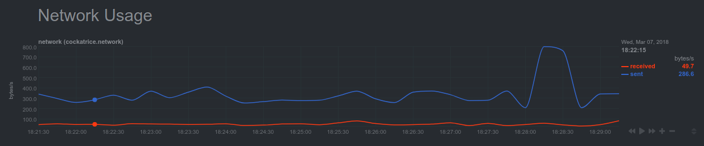

# netdata-cockatrice-plugin



Track statistics about your servatrice install in netdata:
- User stats:
  - Users online
  - Mods online
  - Games open
- Network stats:
  - Bytes sent
  - Bytes recieved

### Install
```sh
git clone https://github.com/skwerlman/netdata-cockatrice-plugin && cd netdata-cockatrice-plugin
sudo cp cockatrice.chart.sh /usr/libexec/netdata/charts.d # NOTE: this may be a different path on your system!
sudo chmod +x /usr/libexec/netdata/charts.d/cockatrice.chart.sh
```

### Configure
Open a new file at `/etc/netdata/charts.d/cockatrice.conf`. Add the following lines:
```ini
cockatrice_database_user=<servatrice databse user>
cockatrice_database_password=<your password here>
cockatrice_database_table=<servatrice table name>
cockatrice_database_prefix=<servatrice table prefix>
```
Remember to edit them according to your setup!
